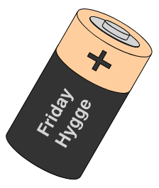

# Friday Hygge Website




## About
This repository contains the source code for the Friday Hygge Website. 


## Development

cd fridayhygge.github.io
python -m http.server
and the open port (by default 8000)
127.0.0.1:8000

### Cloning repository & installing dependencies

1. Clone the repository: ```git clone https://github.com/FridayHygge/fridayhygge.github.io```
2. Create the python virtual environment (I use python 3.9.14): ```virtualenv --py=python3.9 fridayhygge```
3. Activate virtualenv  ```source fridayhygge/bin/activate```
4. Install requirements ```python -m pip install -r requirements.txt```

### Running the website locally (for debugging)

1. Start the http server: ```python -m http.server```
2. Open port (by default 8000) ```127.0.0.1:8000``` on your browser

### Processing images to upload to the website
1. Run the script ```python scripts/process_images.py --path=<directory_or_filepath>```

Usage:

```bash
python scripts/process_images.py --path=<directory_or_filepath>
```

Options:

* `path`: [str] Path to the directory or filepath to the image. All figures in the path will be resized to 128x300 pixels and reduce the quality (for faster loading in the website).

Example:

    python scripts/process_images.py --path=figures/items

The example above would look for all files in the path, then for every figure it will process it if the figure size its other than 128x300. This check is done so that the figures are not processed if they do not need to be, since doing so would reduce the quality of the image every time. The processed figures will overwrite the previous ones.
